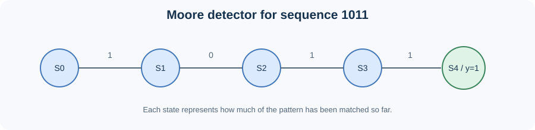

# Moore 1011 Sequence Detector

This circuit watches a stream of 0s and 1s. When it sees the pattern **1011**, its output becomes 1.

> **Diagram note:** This is a simplified reference diagram for understanding the sequence states. It is not a Vivado screenshot or simulation output. Use the actual Vivado waveform to inspect simulated input, state, and output signals.

## How it works

The circuit remembers how much of the pattern it has matched:

- **S0:** Nothing matched yet.
- **S1:** Saw `1`.
- **S2:** Saw `10`.
- **S3:** Saw `101`.
- **S4:** Saw `1011`; output `y` becomes 1.

A **Moore** machine makes its output depend on the current state. The clock moves the circuit from one state to the next.

## Try it

Open `rtl/moore_1011.v` and `testbench/tb_moore_1011.v` in Vivado and run **Behavioral Simulation**. Check the input sequence and output in the waveform.

**Files:** `rtl/moore_1011.v` contains the circuit; the testbench applies input bits and checks the result.
