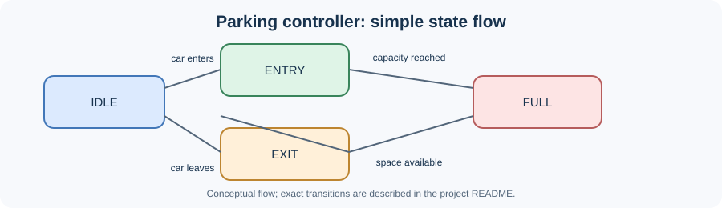

# Parking Lot Controller

A small digital system that keeps track of cars in a parking area.

> **Diagram note:** This is a simplified reference diagram to help understand the controller's behavior. It is not a Vivado screenshot or simulation output. The actual signal behavior should be checked in the Vivado waveform.

## What it does

- Opens the entry gate when a space is available.
- Increases the car count when a car enters.
- Opens the exit gate when a car leaves.
- Turns on the `full` signal when the lot reaches its capacity.
- Blocks new entries when the lot is full.

The default capacity is **4 cars**. The value can be changed using the `CAPACITY` parameter.

## Main signals

| Signal | Meaning |
|---|---|
| `clk` | Clock that synchronizes the controller |
| `reset` | Resets the car count and state |
| `entry_sensor` | Indicates a car at the entrance |
| `exit_sensor` | Indicates a car at the exit |
| `entry_gate` / `exit_gate` | Gate control outputs |
| `count` | Number of cars currently inside |
| `full` | Indicates that the lot is full |

## Try it

Open the RTL and testbench files in Vivado, then run **Behavioral Simulation**. The testbench checks filling the lot, rejecting an extra car, letting cars leave, and handling an exit request when the lot is empty.

**Files:** `rtl/parking_lot_controller.v` is the circuit; `testbench/tb_parking_lot_controller.v` tests it.
