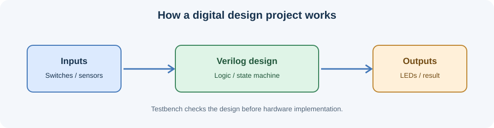

# Vivado Projects

A beginner-friendly collection of digital logic projects written in Verilog and organized for learning and demonstration.

These projects show how I design a circuit, simulate it, and check whether it works.



## Projects

| Project | What it does | Level |
|---|---|---|
| [Adders](01_adders/) | Adds binary numbers using half adders, full adders, and ripple adders. | Beginner |
| [MUX and DEMUX](02_mux_demux/) | Selects one input or routes one input to an output line. | Beginner |
| [T Flip-Flop](03_t_flipflop/) | Stores one bit and toggles it when enabled. | Beginner |
| [Moore 1011 Detector](04_moore_1011_detector/) | Detects the bit pattern `1011` in a serial input. | Beginner–Intermediate |
| [Parking Lot Controller](05_parking_lot_controller/) | Counts cars and controls entry/exit gates for a small parking area. | Intermediate |
| [Vending Machine](06_vending_machine/) | Models a simple machine that accepts inputs and gives a product. | Intermediate |

Each project folder contains:
- `rtl/` — the Verilog circuit.
- `testbench/` — a small test program that checks the circuit.
- `README.md` — a plain-language explanation and how to run it.

## Run a project

You can use **Xilinx Vivado** to create a project, add the RTL and testbench files, and run behavioral simulation.

If Icarus Verilog is installed, you can also run the test suite from the repository folder:

```bash
make test
```

To understand a project, start with its README, then open the RTL file, and finally run its testbench. You do not need to understand the scripts or automation files to learn the circuits.

## Tools

- Verilog HDL
- Xilinx Vivado
- Icarus Verilog (optional, for command-line simulation)

This repository is a learning portfolio of digital design exercises. The projects are intended for simulation and learning; FPGA board deployment may require pin constraints and board-specific setup.

## Author

**Santhosh** · Electronics and Communication Engineering

Released under the MIT License.
